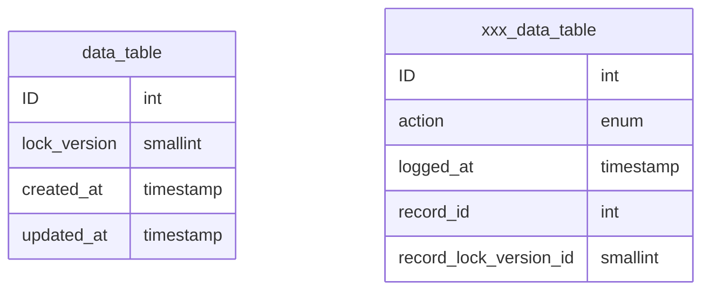
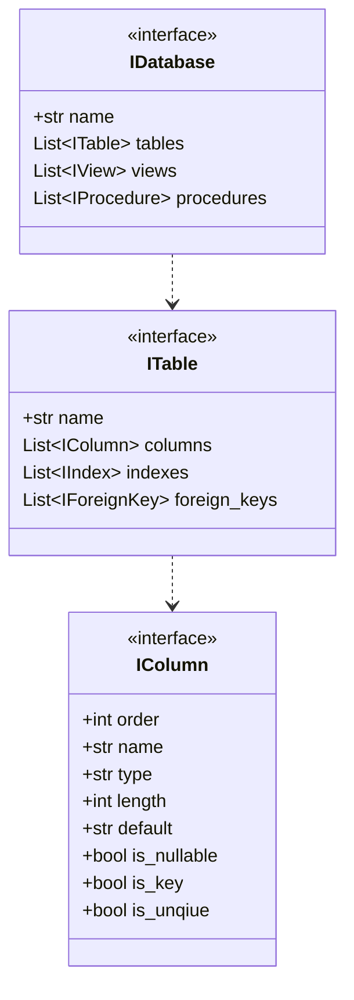

# HI HENRY

## Introduction

## Install

## Usage

The application provides a command line interface and supports the following four commands:

| Command  | Description                                                         |
|----------|---------------------------------------------------------------------|
| create   | creates a new configuration which can be used used to generate code |
| delete   | deletes a previously created configuration                          |
| generate | generates code based on a configuration                             |
| clear    | deletes previously generated code                                   |

### create

This command defines a new configuration that can be used to connect to a database and extract its schema.  The 
command accepts the following parametrs:

| Parameter | Description                                               | Required | Default   |
|-----------|-----------------------------------------------------------|----------|-----------|
| database  | The name of the database to use in generating code        | Yes      |           |
| user      | The name of the database to use in generating code        | Yes      |           | 
| passport  | The user password to use to connect to the database       | Yes      |           |
| driver    | The database management system (DBMS) hostig the database | No       | mysql     |
| host      | The host where which the DBMS is running                  | No       | 127.0.0.1 | 
| port      | The port on which the DMBS is listening                   | No       | 3306      |

The driver parameter currently only supports one option - mysql, others may be added later.

### delete

This command deletes a configuration, previously created with the creaet command.  The command requires the following 
parameter:

| Parameter | Description                                               | Required | Default   |
|-----------|-----------------------------------------------------------|----------|-----------|
| database  | The name of the database to use in generating code        | Yes      |           |

### generate

This command generaets the code. The command supports the following parameter:

| Parameter | Description                                          | Required | Default |
|-----------|------------------------------------------------------|----------|---------|
| database  | The name of the database to use in generating code   | Yes      |         |
| folder    | If provided, code will be generated in this folder   | No       |         |

### clear

This command deletes the contents of the folder where the generated code was stored.  Optionally the default folder can 
be overwritten.

| Parameter | Description                                          | Required | Default |
|-----------|------------------------------------------------------|----------|---------|
| folder    | If provided, code will be generated in this folder   | No       |         |

## Design

### Concept

This utility can be used to generate a set of Data Trasfer Objects (DTO) based on a database schema.  The DTOs are 
based on the [Pydanic package](https://pydantic-docs.helpmanual.io).

The tool supports a particular database design pattern:

- Each table as an id field that uniquely identifiies the record in the table.  If the name is capitalised (ID), it is generated by the DBMS.
- Each table has a lock_version field that is used to support optimistic concurrency.
- Each table has a created_at field that indicates when the record was created
- Each table has an updated_at field that indicates when the record was last updated

When actions need to be audited a second table with same name prefixed with xxx is created.  And each change is logged 
to this table.

When a new record is inserted into the table, the lock_version field is set to 1 and the created_at and updated_at 
fields are  set to the current date and time.  If the action needs to be audited then a new record must be created in 
the corresponding xxx table.  Each table has its own audit tabe to reduce the possibilities of a bottle neck that can 
occur in using a centeral logging table.

When a record is changed the following must occur:

- The lock_versin number must be incremented by one
- The updated_at field must be set to the current date and time
- If an audit is required, then an entry must be created in the corresponding xxx table

### Configuration

### Schema Model

The schema model is represented by a series of associated interfaces, which must be provided by all plugins.

### Code Generation
