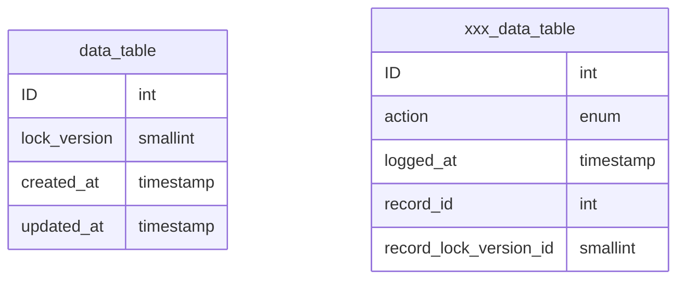
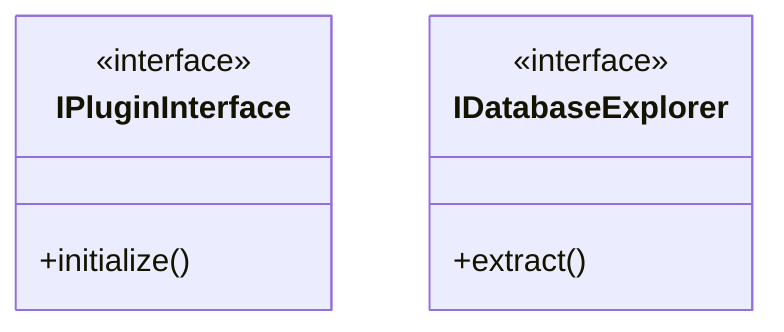
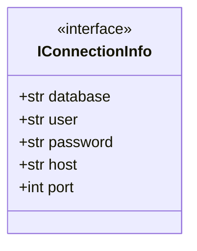
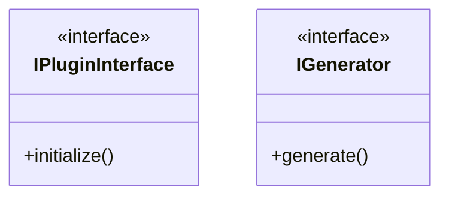
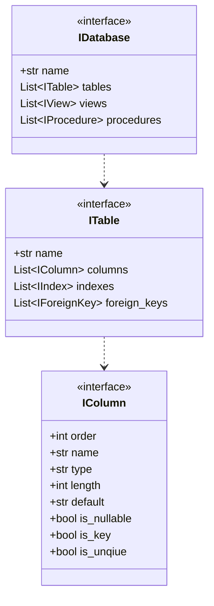
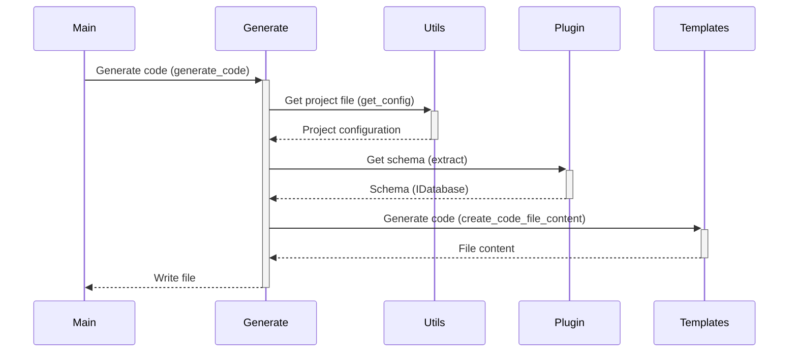

# HI HENRY

## Introduction

The purpose of "Hi Henry" is to generate code to enable an application to access a database.  The applicaton 
currently only supports the MySQL database system and generates Python code.  But has been designed to be extended to 
support other DBMS systems and coding languages through a plugin architecture and a data type mapping mechanisim.

## Install

The application as been designed as a runnable folder.  Simply download a copy of the source code to a
folder and run it using the commands and parameters described below.

## Usage

### generate

This command generaets the code. The command supports the following parameter:

| Parameter | Description                                          | Required | Default |
|-----------|------------------------------------------------------|----------|---------|
| database  | The name of the database to use in generating code   | Yes      |         |
| folder    | If provided, code will be generated in this folder   | No       |         |

### delete

This command deletes the contents of the folder where the generated code was stored.  Optionally the default folder can 
be overwritten.

| Parameter | Description                                          | Required | Default |
|-----------|------------------------------------------------------|----------|---------|
| folder    | If provided, code will be generated in this folder   | No       |         |

### list

This command lists the projects define in the application.  It serves as a check that can be used to make sure projects
have been correctly defined.

## Design

### Concept

This application, as delivered, can be used to generate a set of Data Trasfer Objects (DTO) based on a database schema.  
The DTOs are based on the [Pydanic package](https://pydantic-docs.helpmanual.io).

The tool supports a particular database design pattern:

- Each table as an id field that uniquely identifiies the record in the table.  If the name is capitalised (ID), it is generated by the DBMS.
- The table may have a candidate key also marked as unique
- Each table has a lock_version field that is used to support optimistic concurrency.
- Each table has a created_at field that indicates when the record was created
- Each table has an updated_at field that indicates when the record was last updated
- Enums are favoured over triggers and constraints
- Table creating and seed data insertion are scripted

When actions need to be audited a second table with same name prefixed with xxx is created.  And each change is logged 
to this table.

When a new record is inserted into the table, the lock_version field is set to 1 and the created_at and updated_at 
fields are  set to the current date and time.  If the action needs to be audited then a new record must be created in 
the corresponding xxx table.  Each table has its own audit tabe to reduce the possibilities of a bottleneck that can 
occur in using a centeral logging table.

When a record is changed the following must occur:

- The lock_versin number must be incremented by one
- The updated_at field must be set to the current date and time
- If an audit is required, then an entry must be created in the corresponding xxx table

### Projects 

The application uses the concept of projects to group the information necessary to access a database or similar data 
source and generate code.  The fully defined project contains the following information:

| Key       | Description                                                                  |
|-----------|------------------------------------------------------------------------------|
| name      | The project name                                                             |
| template  | The name of the template to use in generate the code                         |
| files     | Indicates if the generator should generate a file per class or a single file |
| host      | The host where which the DBMS is running                                     |
| port      | The port on which the DMBS is listening                                      | 
| database  | The name of the database to use in generating code                           |
| user      | The name of the database to use in generating code                           |
| passport  | The user password to use to connect to the database                          |
| explorer  | The schema extractor to use in order to obtain the database schema           |
| generator | The generator to use in order to generate the code                           |

The project configurations are stored in the config/projects.toml file.  The format provides for the use of defaults 
that can be overwritten with project specific values.  Default values are stored in a single section titled: defaults, 
while individual project values are stored in subsections within the projects' section with the follow naming 
convention: projects.{project name}

### Logging

The application uses three log file:

| File Name    | Description                                                                                                                   |
|--------------|-------------------------------------------------------------------------------------------------------------------------------|
| main.log     | All activity is logged to this file                                                                                           |
| activity.log | In addition the out come of all steps in the process shoudl be logged here. This is just a handy way of filtering information |
| error.log    | All errors are logged here in addition to the main file.  This is just a handy way of filtering information                   |

### Plugins

The application has been designed to be extended in terms of supporting other DBMS systems and other programming 
languages.  This is done by implementing both processes as a plugin model.

The application discovers the plugins by reading the system.toml file.  For this to happen there needs to be two entries
in the system.toml file:

- A plugins entry that tells the application the name database driver being supported and the name of the module containing the plugin.
- A data map entry that maps the DBMS native data types to their Python/Pydantic types.

#### Explorer Plugins

These plugins need to deliver the schema using the interfaces described below and the module needs to support two 
additional interfaces:

The IPluginInterface is used to register the plugin with the application.  The module is loaded by the application based
on the definition provided by the system.toml file and the initialize() is called.  Within the method the necessary 
methods are called to register the plugin.

The plugin itself must implement the IDatabaseExplorer interface.  This interface is responsible for delivering the 
schema to the application.

When an instance of the explorer is created it is passed an instance of a class that supports the following protocol:

The MySQL plugin located in the plugin folder can be used as implementation reference model.

#### Generator Plugins

These plugins need to generate the code and write it to the file or files, using the interfaces described below 

The generate method is passed the following parameters:

| Parameter       | Type         | Description                                                                     |
|-----------------|--------------|---------------------------------------------------------------------------------|
| project_name    | str          | The project name                                                                |
| schema          | IDatabase    | The deals of the database schema                                                |
| datatype_map    | DataTypeMap  | A map used to map the native data types to the python types                     |
| output_folder   | pathlib.Path | The folder where the generate code is  stored                                   |
| template_folder | pathlib.Path | The folder where the templates used by the generator are located                |
| multi_file      | bool         | Flag to indicate if the code should be wirtten to one file or to multiple files |

### Schema Model

The schema model is represented by a series of associated interfaces, which must be provided by all plugins.

### Code Generation

The interaction between the main application modules is broadly as follows:

