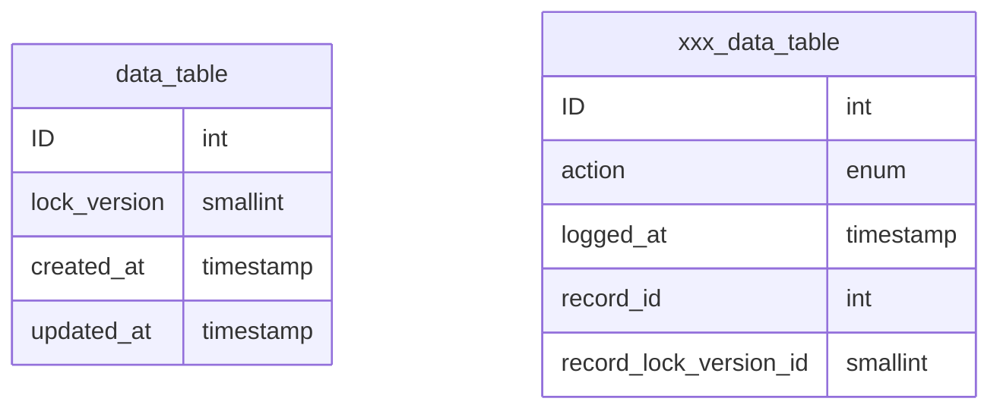
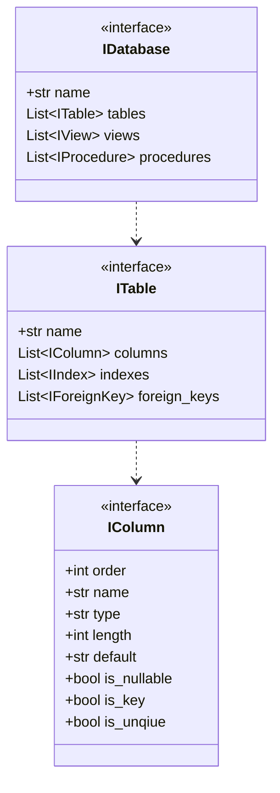
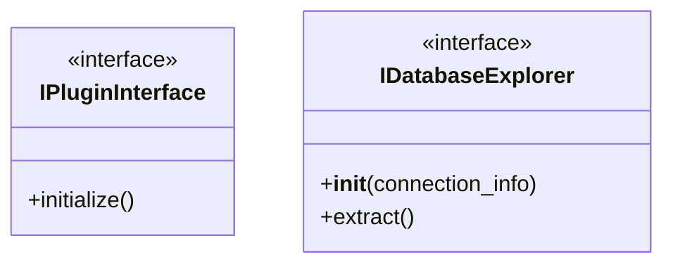
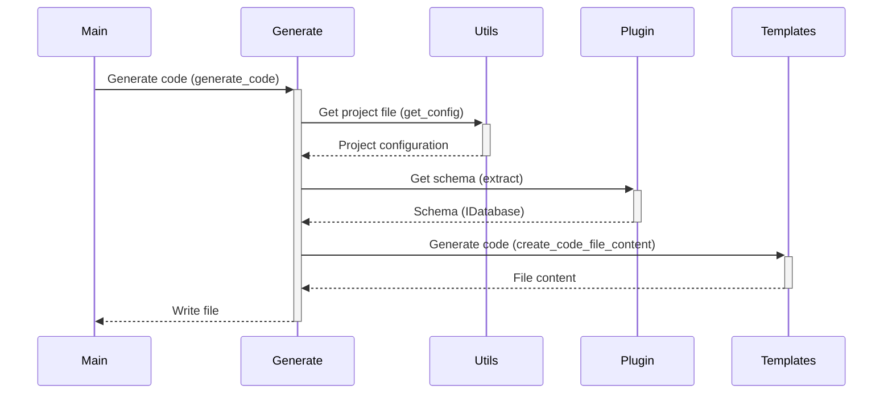

# HI HENRY

## Introduction

The purpose of "Hi Henry" is to generate code to enable an application to access a database.  The applicaton 
currently only supports the MySQL database system and generates Python code.  But has been designed to be extended to 
support other DBMS systems and coding languages through a plugin architecture and a data type mapping mechanisim.

## Projects 

The application uses the concept of projects to group the information necessary to access a database or similar data 
source and generate code.  The fully defined project contains the following information:

| Key       | Description                                                                  |
|-----------|------------------------------------------------------------------------------|
| name      | The project name                                                             |
| template  | The name of the template to use in generate the code                         |
| files     | Indicates if the generator should generate a file per class or a single file |
| host      | The host where which the DBMS is running                                     |
| port      | The port on which the DMBS is listening                                      | 
| database  | The name of the database to use in generating code                           |
| user      | The name of the database to use in generating code                           |
| passport  | The user password to use to connect to the database                          |
| explorer  | The schema extractor to use in order to obtain the database schema           |
| generator | The generator to use in order to generate the code                           |

The project configurations are stored in the config/projects.toml file.  The format provides for the use of defaults 
that can be overwritten with project specific values.  Default values are stored in a single section titled: defaults, 
while individual project values are stored in subsections within the projects' section with the follow naming 
convention: projects.{project name}

## Install

The application as been designed as a runnable folder.  Simply download a copy of the source code to a
folder and run it using the commands and parameters described below.

## Usage

### create

This command defines a new configuration that can be used to connect to a database and extract its schema.  The 
command accepts the following parametrs:

| Parameter | Description                                               | Required | Default   |
|-----------|-----------------------------------------------------------|----------|-----------|
| database  | The name of the database to use in generating code        | Yes      |           |
| user      | The name of the database to use in generating code        | Yes      |           | 
| passport  | The user password to use to connect to the database       | Yes      |           |
| driver    | The database management system (DBMS) hostig the database | No       | mysql     |
| host      | The host where which the DBMS is running                  | No       | 127.0.0.1 | 
| port      | The port on which the DMBS is listening                   | No       | 3306      |

The driver parameter currently only supports one option - mysql, others may be added later.

### delete

This command deletes a configuration, previously created with the creaet command.  The command requires the following 
parameter:

| Parameter | Description                                               | Required | Default   |
|-----------|-----------------------------------------------------------|----------|-----------|
| database  | The name of the database to use in generating code        | Yes      |           |

### generate

This command generaets the code. The command supports the following parameter:

| Parameter | Description                                          | Required | Default |
|-----------|------------------------------------------------------|----------|---------|
| database  | The name of the database to use in generating code   | Yes      |         |
| folder    | If provided, code will be generated in this folder   | No       |         |

### clear

This command deletes the contents of the folder where the generated code was stored.  Optionally the default folder can 
be overwritten.

| Parameter | Description                                          | Required | Default |
|-----------|------------------------------------------------------|----------|---------|
| folder    | If provided, code will be generated in this folder   | No       |         |

## Design

### Concept

This utility can be used to generate a set of Data Trasfer Objects (DTO) based on a database schema.  The DTOs are 
based on the [Pydanic package](https://pydantic-docs.helpmanual.io).

The tool supports a particular database design pattern:

- Each table as an id field that uniquely identifiies the record in the table.  If the name is capitalised (ID), it is generated by the DBMS.
- The table may have a candidate key also marked as unique
- Each table has a lock_version field that is used to support optimistic concurrency.
- Each table has a created_at field that indicates when the record was created
- Each table has an updated_at field that indicates when the record was last updated
- Enums are favoured over triggers and constraints
- Table creating and seed data insertion are scripted

When actions need to be audited a second table with same name prefixed with xxx is created.  And each change is logged 
to this table.

When a new record is inserted into the table, the lock_version field is set to 1 and the created_at and updated_at 
fields are  set to the current date and time.  If the action needs to be audited then a new record must be created in 
the corresponding xxx table.  Each table has its own audit tabe to reduce the possibilities of a bottleneck that can 
occur in using a centeral logging table.

When a record is changed the following must occur:

- The lock_versin number must be incremented by one
- The updated_at field must be set to the current date and time
- If an audit is required, then an entry must be created in the corresponding xxx table

### Configuration

All the configuration files are stored in the config folder.

#### Logging

The application logging is configured via the logging.cfg file.  Logging is configured to write to three files, 
as follows:

| File         | Description                                                                          |
|--------------|--------------------------------------------------------------------------------------|
| main.log     | All log messages are written to this file                                            |
| error.log    | This file is used to log all error messages and above, to make it easy to find them. |
| activity.log | This file is used to detail the steps in the process of generating code              |

The root logger is configured to:
- Log all messages to the main.log file
- Log error messages to the error.log
- Log error messages to the console

A second logger (progress_logger) is configured to:
- Log Info and above messages to the activity.log file to show how the application goes through the process of generating code.
- Propigate the messages to teh root logger

#### Plugin

The information for configurng the plugins is stored in the system.toml file and consists of two parts:

- The plugin entry which defines the plugin 
- The data map entry which maps the database types to the Python and Pydantic data types

### Schema Model

The schema model is represented by a series of associated interfaces, which must be provided by all plugins.

### Extendability

The application has been designed to be extended in terms of supporting other DBMS systems.  This is done by 
implementing the extraction process as a plugin model.  The plugin needs to deliver the schema using the interfaces 
described above and the module needs to support two additional interfaces:

The IPluginInterface is used to register the plugin with the application.  The module is loaded by the application based
on the definition provided by the system.toml file and the initialize() is called.  Within the method the necessary 
methods are called to register the plugin.

The plugin itself must implement the IDatabaseExplorer interface.  This interface is responsible for delivering the 
schema to the application.

The application discovers the plugins by reading the system.toml file.  For this to happen there needs to be two entries
in the system.toml file:

- A plugins entry that tells the application the name database driver being supported and the name of the module containing the plugin.
- A data map entry that maps the DBMS native data types to their Python/Pydantic types.

The MySQL plugin located in the plugin folder can be used as implementation reference model.

### Code Generation

The interaction between the main application modules is broadly as follows:

