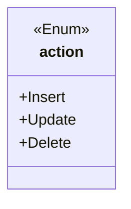
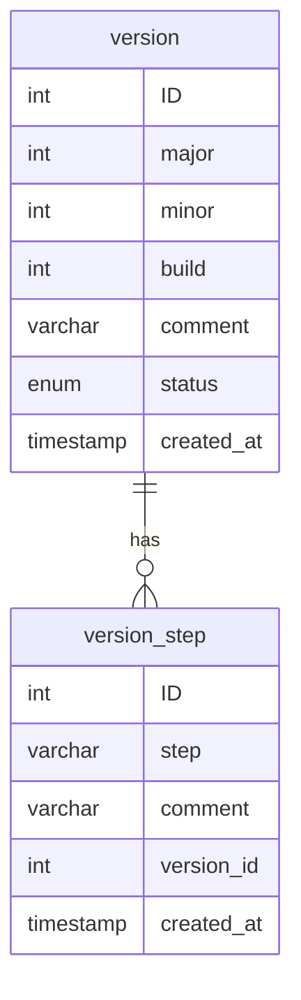
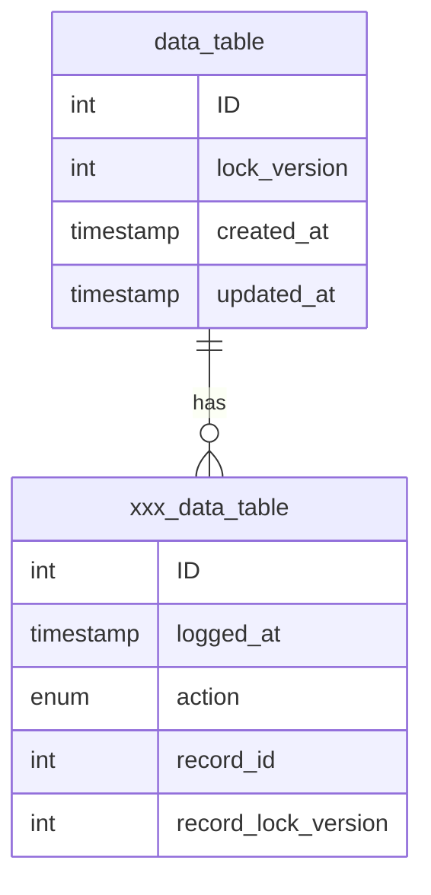

# Database Design

## Introduction

This application comes with a set of templates that can be used to generate Python code for accessing an MySQL 
database.  There are many database design patters that can be implemented using the features provided by this 
application.  This document outlines the pattern underlying the set of templates provided as a default with this 
application.

## Enum

## Versioning

## Data Table

## Summary
